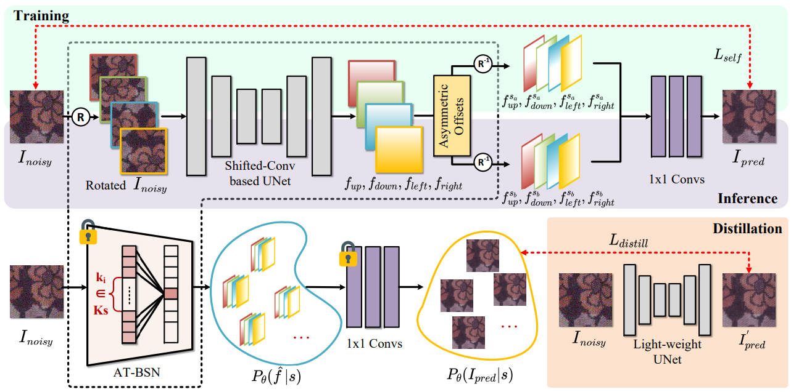
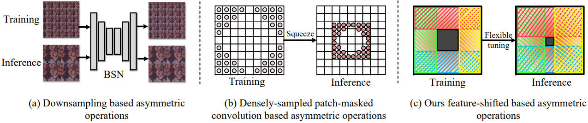
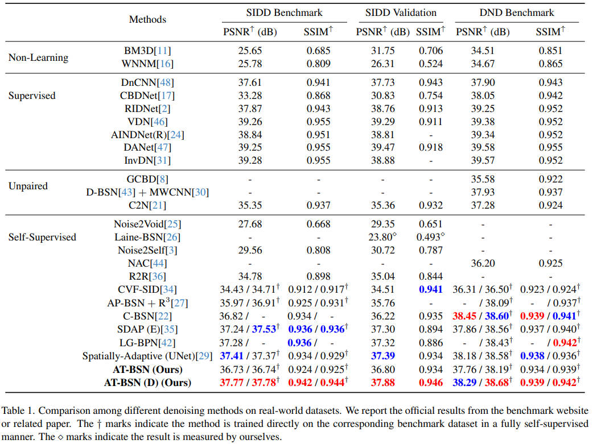
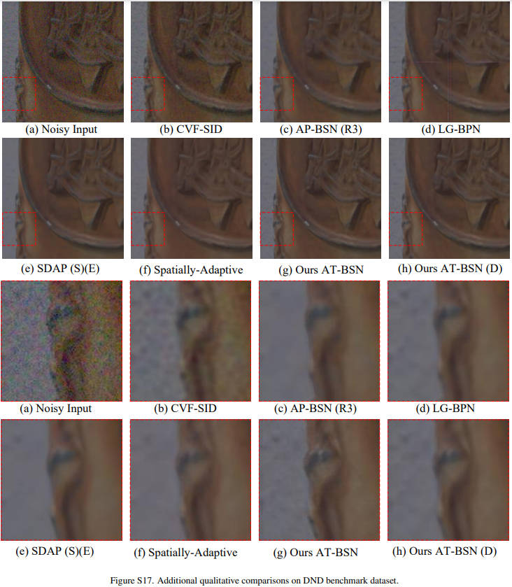

# Exploring Efficient Asymmetric Blind-Spots for Self-Supervised Denoising in Real-World Scenarios

The official implementation code of Exploring Efficient Asymmetric Blind-Spots for Self-Supervised Denoising in Real-World Scenarios (CVPR 2024).

[[official site](https://openaccess.thecvf.com/content/CVPR2024/html/Chen_Exploring_Efficient_Asymmetric_Blind-Spots_for_Self-Supervised_Denoising_in_Real-World_Scenarios_CVPR_2024_paper.html)] [[arXiv version](https://arxiv.org/abs/2303.16783)]





## Abstract
Self-supervised denoising has attracted widespread attention due to its ability to train without clean images. However, noise in real-world scenarios is often spatially correlated, which causes many self-supervised algorithms that assume pixel-wise independent noise to perform poorly. Recent works have attempted to break noise correlation with downsampling or neighborhood masking. However, denoising on downsampled subgraphs can lead to aliasing effects and loss of details due to a lower sampling rate. Furthermore, the neighborhood masking methods either come with high computational complexity or do not consider local spatial preservation during inference. Through the analysis of existing methods, we point out that the key to obtaining high-quality and texture-rich results in real-world self-supervised denoising tasks is to train at the original input resolution structure and use asymmetric operations during training and inference. Based on this, we propose Asymmetric Tunable Blind-Spot Network (AT-BSN), where the blind-spot size can be freely adjusted, thus better balancing noise correlation suppression and image local spatial destruction during training and inference. In addition, we regard the pre-trained AT-BSN as a meta-teacher network capable of generating various teacher networks by sampling different blind-spots. We propose a blind-spot based multi-teacher distillation strategy to distill a lightweight network, significantly improving performance. Experimental results on multiple datasets prove that our method achieves state-of-the-art, and is superior to other self-supervised algorithms in terms of computational overhead and visual effects.

## Usage
```
python train.py -opt options/train/train_atbsn.yml

python train.py -opt options/train/distill_atbsn.yml

python -m torch.distributed.launch --nproc_per_node=2 --master_port=12345 train.py -opt options/train/train_atbsn.yml --launcher pytorch
```

```
python valid.py -opt options/test/test_atbsn.yml
```

```
python test.py -opt options/test/test_atbsn.yml
```

## Comparisons for Real-World Denoising

### Quantitative results


### Quantitative results


## Citation
```
@inproceedings{chen2024exploring,
  title={Exploring Efficient Asymmetric Blind-Spots for Self-Supervised Denoising in Real-World Scenarios},
  author={Chen, Shiyan and Zhang, Jiyuan and Yu, Zhaofei and Huang, Tiejun},
  booktitle={Proceedings of the IEEE/CVF Conference on Computer Vision and Pattern Recognition},
  pages={2814--2823},
  year={2024}
}
```